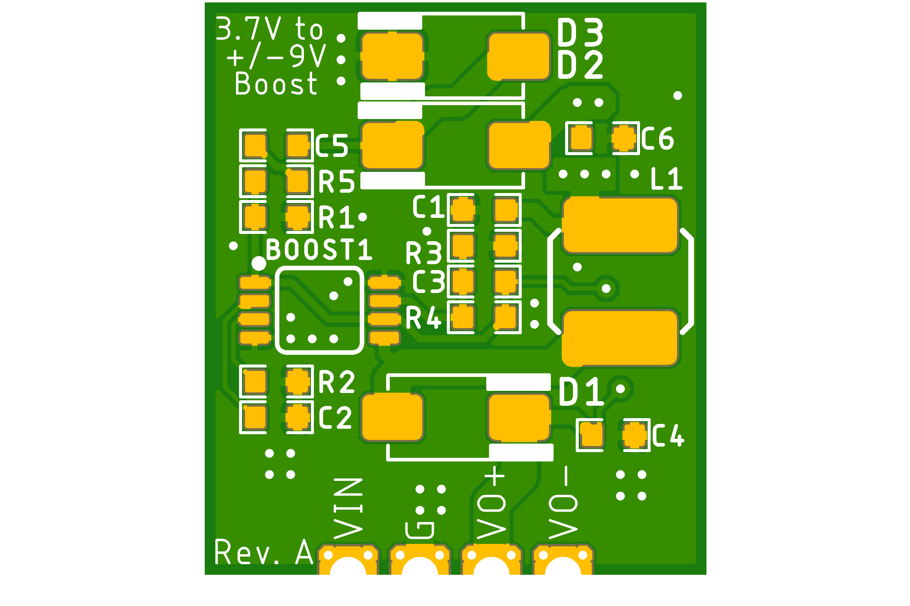
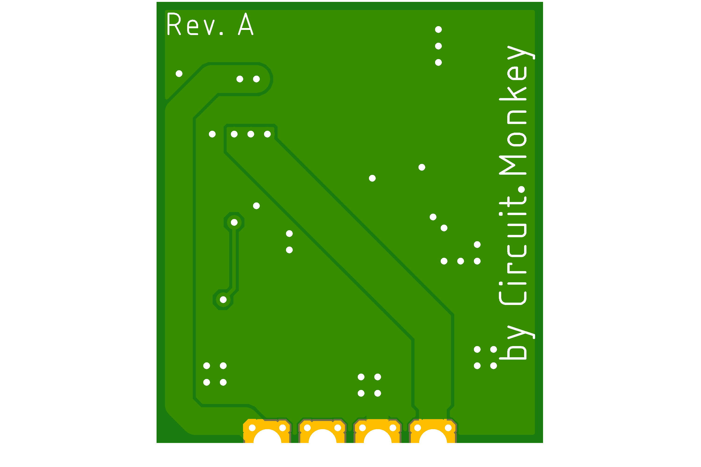

# voltage-booster-pos-neg
Low voltage to +/-9V voltage booster circuit using MIC2145.

## About this Circuit
Experimental PCB that boosts nominal 3.7V to 9VDC while also adding
a -9VDC rail.  I needed both +9 and -9 for an analog sythesizer experiment
but my power supply design got a little complicaed and expensive using
Pololu boost modules.  Once I built my synth circuit, I was able to characterize
my power needs (about 200mA at 9V and much less at -9V).

Based on this application note from Texas Instruments:
https://www.ti.com/lit/an/slvaej3/slvaej3.pdf

Will it work?

## Images

